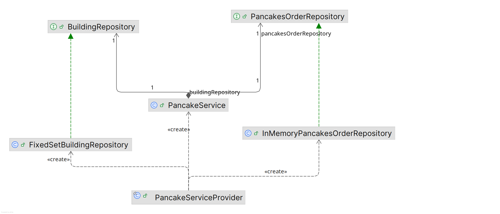
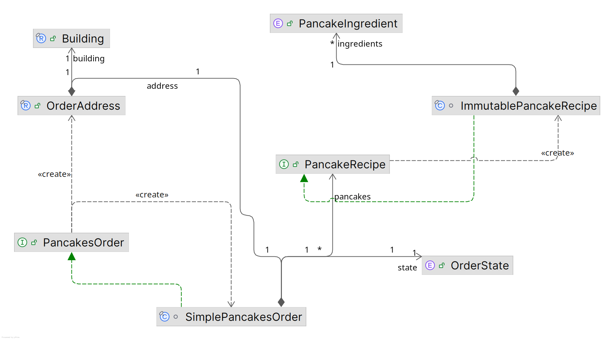

# Backery Shop

### Module was created only for demonstration purposes

This why you will find various solutions like
[InMemoryPancakesOrderRepository](src/main/java/org/bakeryshop/domain/repository/order/InMemoryPancakesOrderRepository.java)
[ThreadSafePancakesOrder](src/main/java/org/bakeryshop/domain/repository/order/ThreadSafePancakesOrder.java)
[OrderLog](src/main/java/org/bakeryshop/service/OrderLog.java)

instead of well known solutions(for instance spring data repositories etc.)

#### Module exposes [PancakeService](src/main/java/org/bakeryshop/service/PancakeService.java) to clients.

#### The business logic is encapsulated in domain layer, see

[SimplePancakesOrder](src/main/java/org/bakeryshop/domain/model/order/SimplePancakesOrder.java)

